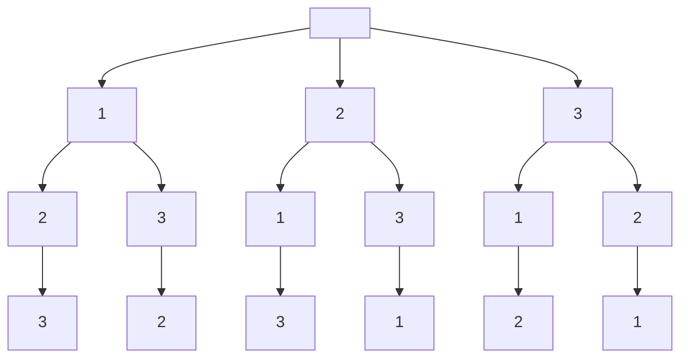

## Solutions
### solution1
采用回溯算法,回溯算法的框架为
```
result = []
def backtrack(路径, 选择列表):
    if 满足结束条件:
        result.add(路径)
        return

    for 选择 in 选择列表:
        做选择
        backtrack(路径, 选择列表)
        撤销选择
```
需要注意的是，result.add(路径) 需要深度拷贝


