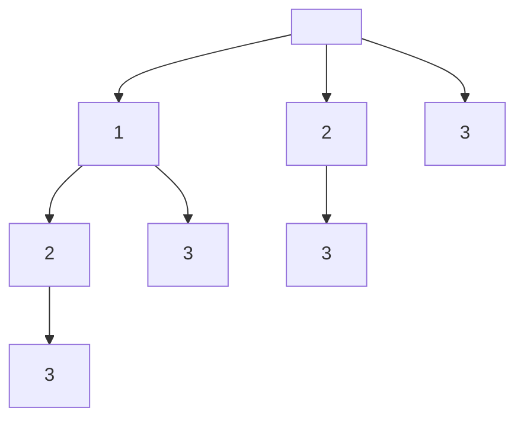

## Solutions
### solution 1
回溯。参考 [回溯法求子集](https://leetcode-cn.com/problems/subsets/solution/hui-su-fa-qiu-zi-ji-by-aalchemist-zndi/)

与全排列相比，子集的特点是
- 每经过一个节点就输出一次
- 子节点的循环的起点是父节点+1，而全排列是每次都从0开始

```mermaid
graph TB
    root[ ] --> Node11[1]
    root --> Node12[2]
    root --> Node13[3]
    Node11 --> Node21[2]
    Node11 --> Node22[3]
    Node12 --> Node23[3]
    Node21 --> Node31[3]
```