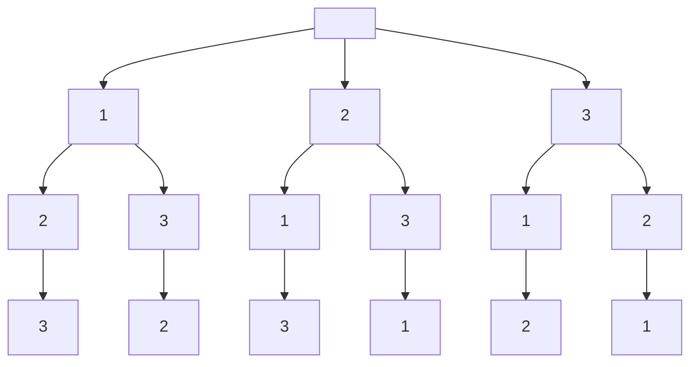

## Solutions
### solution1
采用回溯算法,回溯算法的框架为
```
result = []
def backtrack(路径, 选择列表):
    if 满足结束条件:
        result.add(路径)
        return

    for 选择 in 选择列表:
        做选择
        backtrack(路径, 选择列表)
        撤销选择
```
需要注意的是，result.add(路径) 需要深度拷贝



参考 https://leetcode-cn.com/problems/permutations-ii/solution/47hui-su-jian-zhi-zhong-fu-shu-by-bu-zhi-h7dm/

主要讲一下为什么剪枝条件加了一个!used[i-1]？其实图里也很清楚，我们知道重复必定发生在决策树的同一层，当我们只有i>0 && nums[i] == nums[i-1]时，有一种可能是nums[i-1]和nums[i]在同一条路径上，nums[i-1]是num[i]的父节点，对应图中左下的箭头，是生成[1,1*]的那条路，可以重复选。而我们需要剪的是回溯到选第一个位置时，选到第二个1，这个和之前的那个1是同一层的，而且是重复的，因此必须再加上一个!used[i-1]来保证不是重复选择[1,1*]的情况确实是同一层选重复了。
