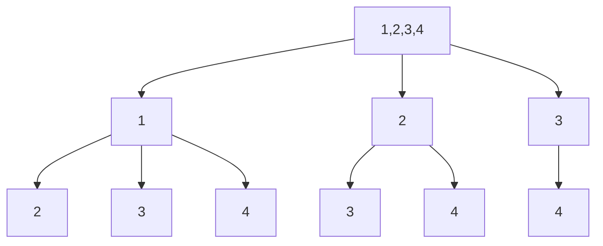

## Solutions
### solution 1：回溯

这个解法使用回溯算法来生成所有可能的组合。主要思路如下:

1. 使用一个数组 path 记录当前正在构建的组合路径
2. 使用回溯函数 backtrack(begin) 来生成组合:
   - begin 表示当前可以选择的起始数字
   - 当 path 长度等于 k 时,说明找到一个有效组合,将其加入结果集
   - 从 begin 开始遍历到 n,对每个数字:
     1. 选择该数字加入 path
     2. 递归调用 backtrack(i+1) 选择下一个数字
     3. 回溯:将该数字从 path 移除
3. 最后返回所有生成的组合

时间复杂度: O(C(n,k))
空间复杂度: O(k)
